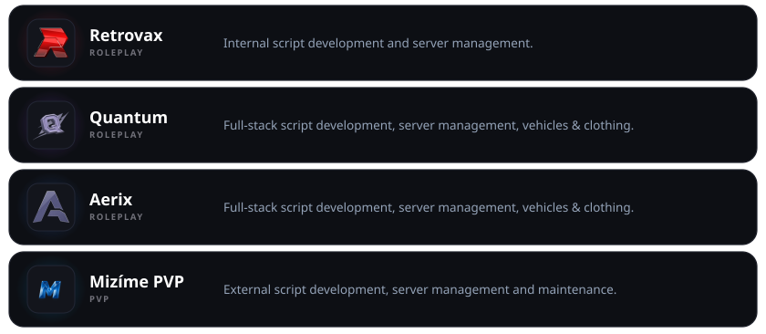

  

<h3 align="center"> &nbsp;Developer</h3>

  

---

<h3 align="center"> &nbsp;About Me</h3>

  

  

  

---

<h3 align="center"> &nbsp;Languages & Tools</h3>

  

   &nbsp;&nbsp;
   &nbsp;&nbsp;
   &nbsp;&nbsp;
   &nbsp;&nbsp;
  

  

   &nbsp;&nbsp;
   &nbsp;&nbsp;
   &nbsp;&nbsp;
   &nbsp;&nbsp;
   &nbsp;&nbsp;
   &nbsp;&nbsp;
  

  

   &nbsp;&nbsp;
   &nbsp;&nbsp;
  

---

<h3 align="center"> &nbsp;My Projects</h3>

  

